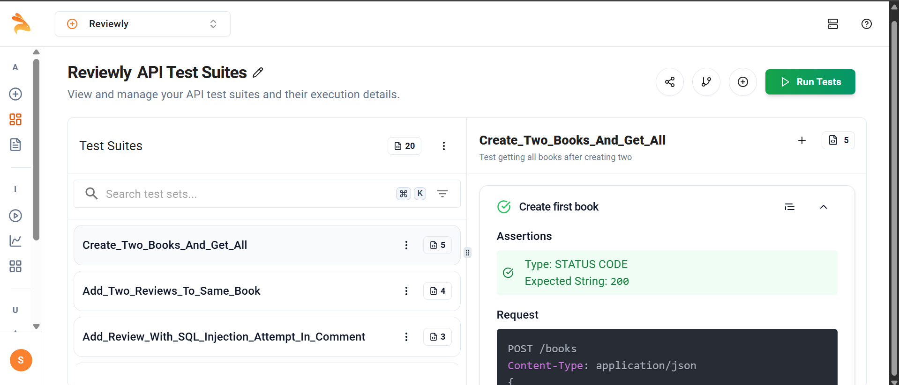

# 📚 Book Review API

This is a simple Book Review REST API built using **Flask** and **MongoDB** as part of the **Keploy API Fellowship**.

---

## ✅ Keploy API Testing & CI/CD Integration

- This project is integrated with **Keploy** for **AI-powered API testing**.
- CI/CD is handled via **GitHub Actions**, and Keploy test suites run automatically on every push.
- All test reports are visible on the [Keploy Dashboard](https://app.keploy.io).

### 🧪 GitHub Actions Status


### 📸 Keploy Test Suite Screenshot



---

## 🚀 Features

- Create, Read, Update, and Delete books
- Add reviews to books
- MongoDB for data storage
- Clean API structure using Flask Blueprints

---

## 🛠️ Tech Stack

- **Backend:** Flask (Python)
- **Database:** MongoDB Atlas
- **Testing:** Keploy
- **Dev Tools:** Postman, Python-dotenv
- **CI/CD:** GitHub Actions + Keploy

---

## 📦 API Endpoints

### 📚 Books

| Method | Endpoint           | Description             |
|--------|--------------------|-------------------------|
| GET    | `/books`           | Get all books           |
| POST   | `/books`           | Add a new book          |
| PUT    | `/books/<id>`      | Update a book           |
| DELETE | `/books/<id>`      | Delete a book           |

### ⭐ Reviews

| Method | Endpoint                    | Description          |
|--------|-----------------------------|----------------------|
| POST   | `/books/<id>/reviews`       | Add a review to book |

---

## ⚙️ How to Run the Server

1. Clone this repository:
```bash
git clone https://github.com/Sudhanshu137/book-review-api.git
cd book-review-api

2. Create a virtual environment and activate it:
```bash
python -m venv venv
source venv/bin/activate  # On Windows: venv\Scripts\activate
```


3. Install dependencies:
```bash
   pip install -r requirements.txt
```

4. Set up environment variables in a `.env` file:
```bash
   - `MONGO_URI`: Your MongoDB Atlas connection string
   - `DB_NAME`: The database name (e.g., `bookreviewdb`)
```

5.  Run the Flask server:
```bash
     python app.py
```     
